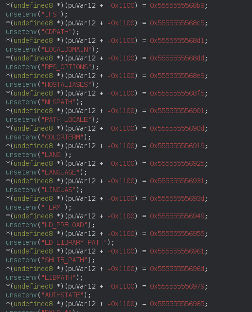

-----------------------------[ CVE-2022-37706 ]--------------------------------
-------------------------------------------------------------------------------
Hello guys, this time I'm gonna talk about a recent 0-day I found in one of the
main window managers of Linux called Enlightenment (https://www.enlightenment.org/).<br>
This 0-day gonna take any user to root privileges very easily and instantly.
The exploit is tested on Ubuntu 22.04, but should work just fine on any distro.

First of all Enlightenment is a Window Manager, Compositor and Minimal Desktop 
for Linux (the primary platform), BSD and any other compatible UNIX system.

I installed this window manager to experiment a bit with it. It was interesting
for me as it contain a lot of tools and it looks pretty neat to be honest.

After I installed the package using `apt install enlightenment` I examined the
installed files and directory on my system, a lot of modules and a lot of help-
er binaries, but what is most interesting is :<br>
```
➜  enlightenment cd /usr/lib/x86_64-linux-gnu/enlightenment/
➜  enlightenment find . -perm -4000                         
./utils/enlightenment_ckpasswd
./utils/enlightenment_system
./utils/enlightenment_sys
```

It installs some SUID binaries, then I was thinking if I can use one of those
to escalate to root, the binaries were all secure looking and well coded.
The binary we will be talking about is enlightenment_sys.

As any other target we choose a strategy to apply after doing some pre-assessm-
ent see my blog here if not yet 
(https://pwn-maher.blogspot.com/2020/10/vulnerability-assessment.html)

I audited the code on a Top-Down approach.
And because this window manager is open source, the source code will be availa-
ble for all those binaries and modules.
So first thing I did was `apt source enlightenment` to get all the source code,
and with a big of digging we can get to the target binary code.

But to debug the binary I load it to Ghidra for analysis and to have addresses
to set breakpoints and all.
No symbols were found first try but yeah no need for those as it turned out to
be a relatively small binary.
Surprisingly, I found it very pleasing to look at the decompiled pseudo-code of
Ghidra than looking directly at the src (avoid macros, avoid also those checks
against the OS being used to compile a specific block of code).

So let's start analysis.

1- Play with the binary.
Let's run the file to see some information about our target:


Running the binary do not give any output:


Giving --help argument gave this output:

Sorry, I will use it to get root.

Next let's just strace and see if it will use any suspicious syscalls like
execve or openat:
strace ./enlightenment_sys 2>&1 | grep open 

It just opens known libraries at places we don't have permission to tamper with.

strace ./enlightenment_sys 2>&1 | grep exec


2- Let's reverse engineer the binary and then exploit it.

I created a new Ghidra project, and I loaded this specific binary.
Because symbols were not found, we can spot the main function using entry.
The first argument to entry function is main itself.
I renamed it to main for future references.
Scrolling a bit down I can already spot system() function being used.
 

As a pwner I spend days on challenges to spawn this specific function x)
I reversed the binary looking for a memory corruption bug or some heap problems
, but actually it was a weird Command Injection.
The binary take all security precautions before running system, but sadly we
can always inject our input in there.


Ok, now let's walk the binary from top up to our system function, trying to
inject our input in there.

First the binary just checks if the first arg is --help or -h and shows that
message we saw earlier.


Second it elevate it's privileges to root.


Next it unset almost all environment variables (security precautions) to not
invoke another non-intended binary.


So if the first arg we entered is "mount" it will enter this branch, check some
flags given, those flags gonna be set on the stack.

Next it checks if the next param after mount is UUID= we don't want to enter
here, so we gave "/dev/../tmp/;/tmp/exploit".

Like this we pass the check at line 410. the strncmp check.
Because if it don't start with /dev/ the binary will exit.
Next there is a call to stat64 on that file we provided, note that we can
create a folder called ";" and that will be causing the command injection.
Until now, the exploit already created this file /dev/../tmp/;/tmp/exploit,
but this is not the exploit that will be called.


We're getting closer to system() now.
Now p (pointer), get's updated to the last argument given to our SUID binary,
/tmp///net.

Why providing /tmp///net when we can pass /tmp/net?
We will bypass this check:
if (((next_next == (char *)0x0) || (next_next[1] == '\0')) || ((long)next_next - (long)p != 6))
We needed /tmp/net to exist and /tmp/// to be on length 6.


Now the last stat64 will check for the existence of "/dev/net"
__snprintf_chk(cmd,0x1000,1,0x1000,"/dev%s",next_next);
And it will find it, so we pass that last check.

Now it will check for the availability for some files, but that's not important
at this point, because we're all set and all close to trigger arbitrary Command
Execution.

Now eina_strbuf_new() will just initialize the command that will be passed to
system, the problem here is that we entered it as:

/bin/mount -o noexec,nosuid,utf8,nodev,iocharset=utf8,utf8=0,utf8=1,uid=$(id -u), "/dev/../tmp/;/tmp/exploit" /tmp///net

But the binary calls eina_strbuf_append_printf() for several times and becomes
/bin/mount -o noexec,nosuid,utf8,nodev,iocharset=utf8,utf8=0,utf8=1,uid=$(id -u), /dev/../tmp/;/tmp/exploit /tmp///net
Notice that double quotes are removed, and we will be able to call /tmp/exploit
as root.


The binary tried it's best to mitigate any non-intended behavior but as usual
anything can be pwned. I wasn't expecting to exploit this using a logical bug
like this.
I want the next CVE to be a memory corruption leading to LPE root.
