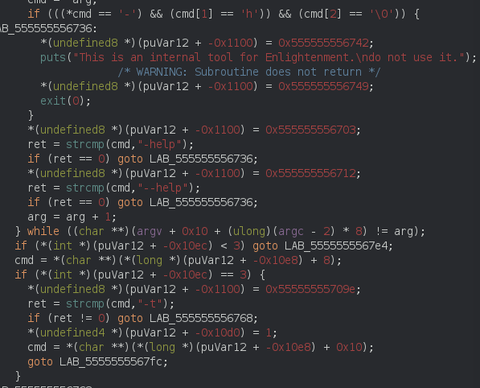
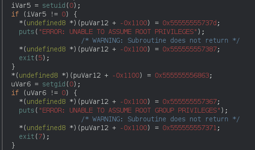
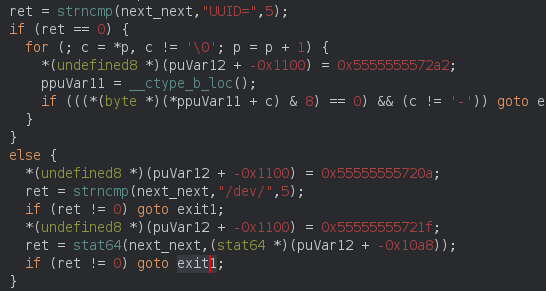
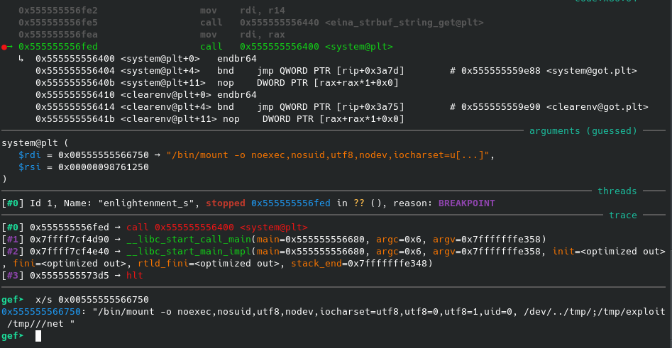

<h1>CVE-2022-37706</h1>


Hello guys, this time I'm gonna talk about a recent 0-day I found in one of the<br>
main window managers of Linux called Enlightenment (https://www.enlightenment.org/).<br>
This 0-day gonna take any user to root privileges very easily and instantly.<br>
The exploit is tested on Ubuntu 22.04, but should work just fine on any distro.<br>

First of all Enlightenment is a Window Manager, Compositor and Minimal Desktop <br>
for Linux (the primary platform), BSD and any other compatible UNIX system.<br>

I installed this window manager to experiment a bit with it. It was interesting<br>
for me as it contain a lot of tools and it looks pretty neat to be honest.<br>

After I installed the package using `apt install enlightenment` I examined the<br>
installed files and directory on my system, a lot of modules and a lot of helper<br>
binaries, but what is most interesting is :<br>
```
➜  enlightenment cd /usr/lib/x86_64-linux-gnu/enlightenment/
➜  enlightenment find . -perm -4000                         
./utils/enlightenment_ckpasswd
./utils/enlightenment_system
./utils/enlightenment_sys
```

It installs some SUID binaries, then I was thinking if I can use one of those<br>
to escalate to root, the binaries were all secure looking and well coded.<br>
The binary we will be talking about is enlightenment_sys.<br>

As any other target we choose a strategy to apply after doing some pre-assessment<br>
see my blog here if not yet (https://pwn-maher.blogspot.com/2020/10/vulnerability-assessment.html)<br>

I audited the code on a Top-Down approach.<br>
And because this window manager is open source, the source code will be available<br>
for all those binaries and modules.<br>
So first thing I did was `apt source enlightenment` to get all the source code,<br>
and with a big of digging we can get to the target binary code.<br>

But to debug the binary I load it to Ghidra for analysis and to have addresses<br>
to set breakpoints and all.<br>
No symbols were found first try but yeah no need for those as it turned out to<br>
be a relatively small binary.<br>
Surprisingly, I found it very pleasing to look at the decompiled pseudo-code of<br>
Ghidra than looking directly at the src (avoid macros, avoid also those checks<br>
against the OS being used to compile a specific block of code).<br>

So let's start analysis.<br>

1- Play with the binary.<br>
Let's run the file to see some information about our target:<br>
<br>

Running the binary do not give any output:<br>
<br>

Giving --help argument gave this output:<br>
<br>
Sorry, I will use it to get root.<br>

Next let's just strace and see if it will use any suspicious syscalls like<br>
execve or openat:<br>
strace ./enlightenment_sys 2>&1 | grep open <br>
<br>
It just opens known libraries at places we don't have permission to tamper with.<br>

strace ./enlightenment_sys 2>&1 | grep exec<br>
<br>

2- Let's reverse engineer the binary and then exploit it.<br>

I created a new Ghidra project, and I loaded this specific binary.<br>
Because symbols were not found, we can spot the main function using entry.<br>
The first argument to entry function is main itself.<br>
I renamed it to main for future references.<br>
Scrolling a bit down I can already spot system() function being used.<br>
 <br>

As a pwner I spend days on challenges to spawn this specific function x)<br>
I reversed the binary looking for a memory corruption bug or some heap problems<br>
, but actually it was a weird Command Injection.<br>
The binary take all security precautions before running system, but sadly we<br>
can always inject our input in there.<br>
<br>

Ok, now let's walk the binary from top up to our system function, trying to<br>
inject our input in there.<br>

First the binary just checks if the first arg is --help or -h and shows that<br>
message we saw earlier.<br>
<br>

Second it elevate it's privileges to root.<br>
<br>

Next it unset almost all environment variables (security precautions) to not<br>
invoke another non-intended binary.<br>
<br>

So if the first arg we entered is "mount" it will enter this branch, check some<br>
flags given, those flags gonna be set on the stack.<br>

Next it checks if the next param after mount is UUID= we don't want to enter<br>
here, so we gave "/dev/../tmp/;/tmp/exploit".<br>
<br>
Like this we pass the check at line 410. the strncmp check.<br>
Because if it don't start with /dev/ the binary will exit.<br>
Next there is a call to stat64 on that file we provided, note that we can<br>
create a folder called ";" and that will be causing the command injection.<br>
Until now, the exploit already created this file /dev/../tmp/;/tmp/exploit,<br>
but this is not the exploit that will be called.<br>
<br>
<br>

We're getting closer to system() now.<br>
Now p (pointer), get's updated to the last argument given to our SUID binary,<br>
/tmp///net.<br>

Why providing /tmp///net when we can pass /tmp/net?<br>
We will bypass this check:<br>
`if (((next_next == (char *)0x0) || (next_next[1] == '\0')) || ((long)next_next - (long)p != 6))`<br>
We needed /tmp/net to exist and /tmp/// to be on length 6.<br>


Now the last stat64 will check for the existence of "/dev/net"<br>
__snprintf_chk(cmd,0x1000,1,0x1000,"/dev%s",next_next);<br>
And it will find it, so we pass that last check.<br>

Now it will check for the availability for some files, but that's not important<br>
at this point, because we're all set and all close to trigger arbitrary Command<br>
Execution.<br>

Now eina_strbuf_new() will just initialize the command that will be passed to<br>
system, the problem here is that we entered it as:<br>

/bin/mount -o noexec,nosuid,utf8,nodev,iocharset=utf8,utf8=0,utf8=1,uid=$(id -u), "/dev/../tmp/;/tmp/exploit" /tmp///net<br>

But the binary calls eina_strbuf_append_printf() for several times and becomes<br>
/bin/mount -o noexec,nosuid,utf8,nodev,iocharset=utf8,utf8=0,utf8=1,uid=$(id -u), /dev/../tmp/;/tmp/exploit /tmp///net<br>
Notice that double quotes are removed, and we will be able to call /tmp/exploit<br>
as root.<br>
<br>

The binary tried it's best to mitigate any non-intended behavior but as usual<br>
anything can be pwned. I wasn't expecting to exploit this using a logical bug<br>
like this.<br>
I want the next CVE to be a memory corruption leading to LPE root.<br>
